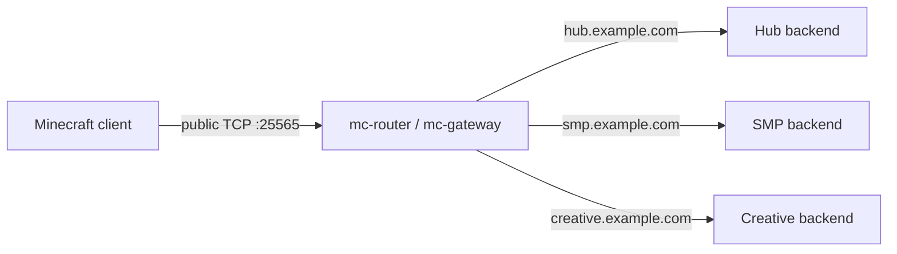
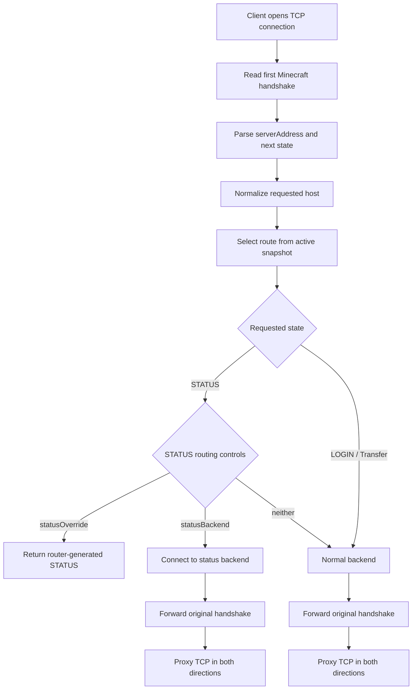
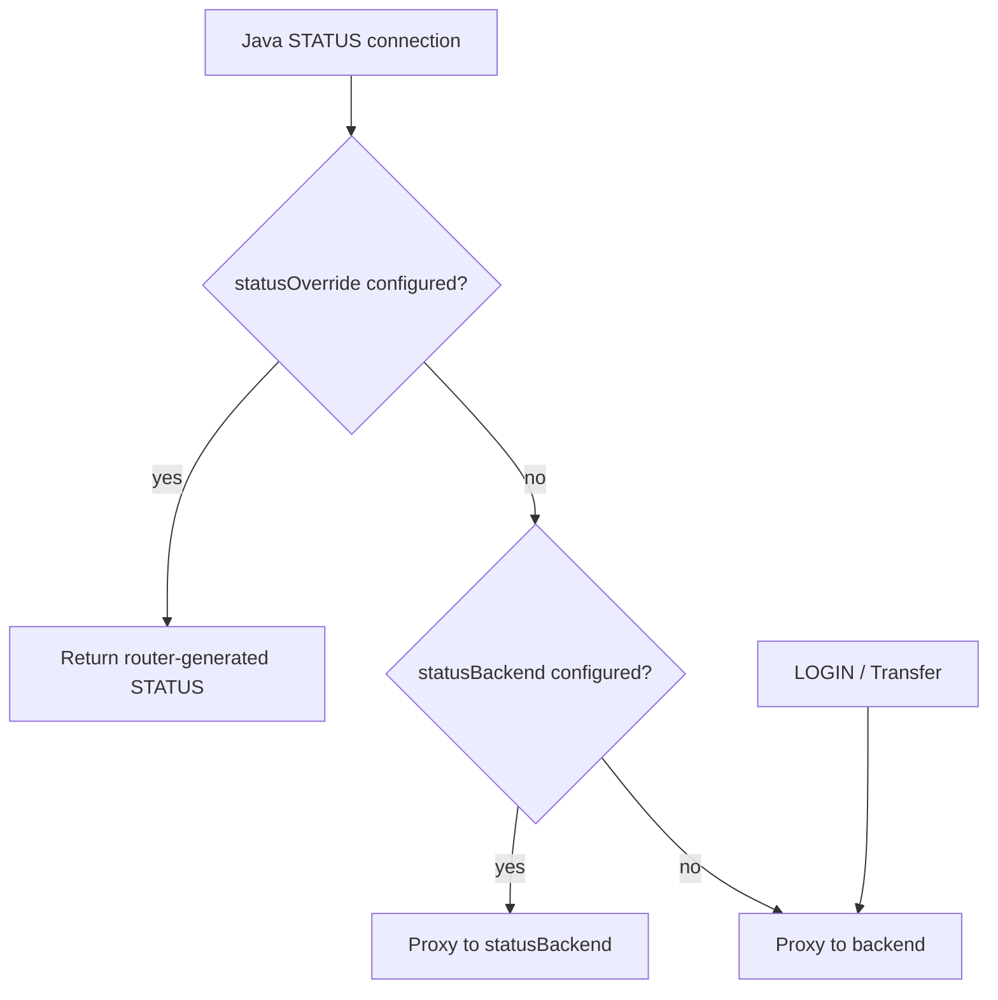
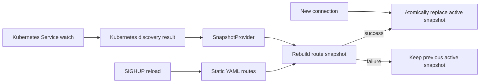
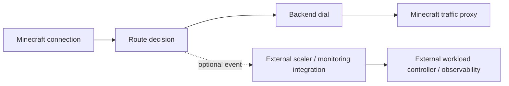

# Architecture diagrams

This page provides diagram-as-code views of the main `mc-router` routing and control boundaries.

The diagrams are intentionally high-level. [`architecture.md`](architecture.md) remains the detailed source of truth for edge cases, failure handling, timeouts, fallback semantics, and implementation-specific behavior.

## High-level routing

Several public DNS names can point to the same listener. The hostname from the Minecraft handshake selects the internal backend.

## Java connection flow

Normal Java routing inspects only the initial handshake needed for routing. After backend selection, the remaining connection is proxied as TCP traffic.

## STATUS routing precedence

The explicit precedence is `statusOverride -> statusBackend -> backend`. LOGIN and Minecraft Transfer traffic continue to use the normal backend.

## Route snapshot updates

Static configuration and Kubernetes discovery feed the same route-snapshot model. A failed rebuild preserves the previously active snapshot, while new connections use the latest successfully published snapshot.

## Routing and control-plane boundary

Optional notifications and monitoring integrations are deliberately outside routing correctness. Their state does not implicitly redefine LOGIN, Transfer, or ordinary STATUS routing.
